# 16级南开大学企业级应用开发课程作业

作业内容：oj系统

需求设计阶段：

入组后依次打卡： 

- 1611736 钟腾
- 1612911 于浩
- 1511459 魏鹏
- 1612904 薛旭

##### 目录 
[在线oj平台开发要求](#在线oj平台开发要求)  

[数据库设计](#数据库设计)    

[需求思维导图](#需求思维导图)

[操作流程](#操作流程)

## 在线oj平台开发要求

1. 支持长期使用（一学期15次左右，每周至少运行6天没问题）

2. 支持作业查重（初期可全文字符串比对）

3. 支持多语言（中英文）

4. 支持出错判断和整体统计，具体错误提供学生自身改进，全局错误统计供教师了解学生掌握情况。

5. 题目和测试用例的文档导出（可打印出格式良好的题目）

6. 明确学生、任课教师（出题、题目发布、成绩统计）、助教、系统管理员的权限

## 数据库设计

学生表：学号（pk）、密码、学生名、所选课程id（fk）

教师表：教师id（pk）、密码、教师名、所教课程id（fk）

课程表：课程id（pk ai）、课程名、开课时间、结束时间

题目表：题目id（pk ai）、题目名、题目描述、开始日期、截止日期、所属课程id（fk）、样例输入、样例输出、题目类别（1为练习、2为作业、3为考试）

提交方案表：提交结果id（pk ai）、题目id（fk）、学生id（fk）、提交方案、答案结果、提交时间

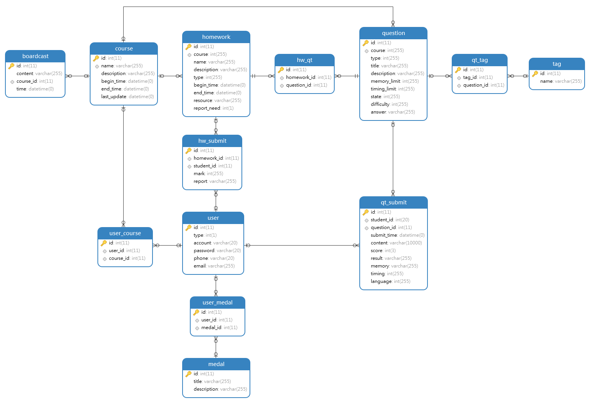

## 需求思维导图
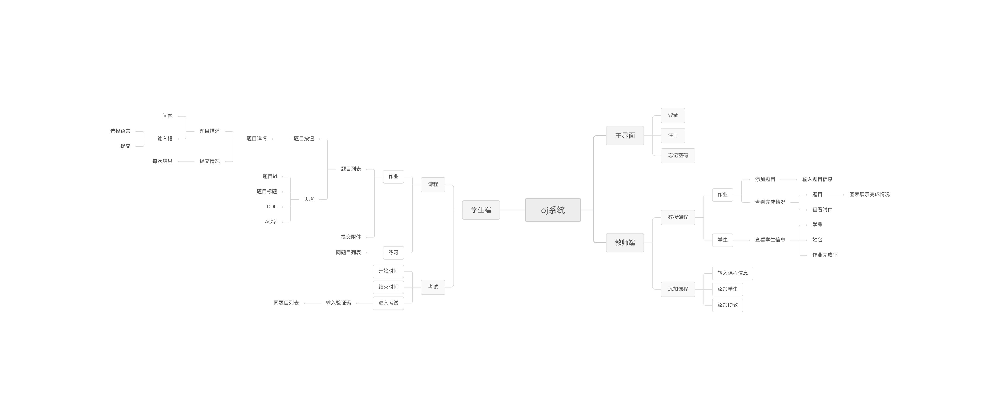

## 操作流程
**一、学生端**

  1. 注册登录 
    点击账号文本框，输入学生账号 
    点击密码文本框，输入学生密码 
    点击登录按钮，进入oj系统学生端 
    点击注册按钮，进行注册 
    点击忘记密码按钮，找回密码 
    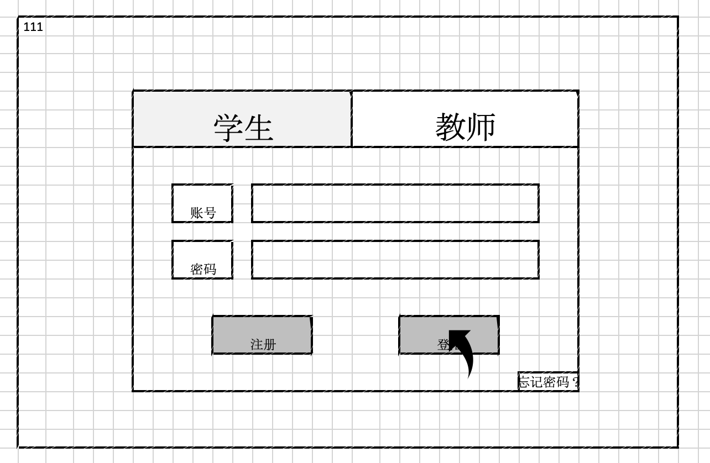
  2. 进入课程 
    该页面会显示学生已选的课程。对于每一门课，会显示开始和结束时间 
    点击考试进入按钮，进入考试，如下图7所示 
    点击查看详情按钮，进入课程，如下图3、4所示 
    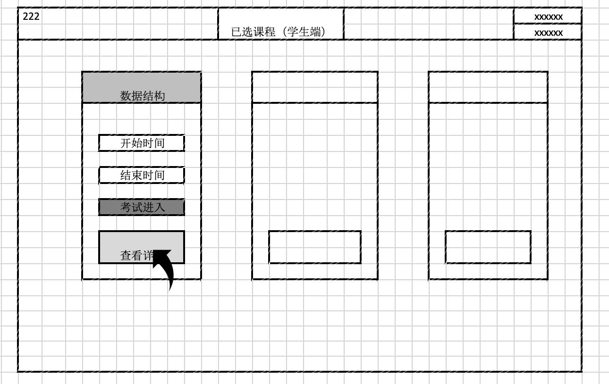
  3. 练习题目列表 
    点击页眉的作业按钮，切换到作业模式，如下图4 
    显示练习题目列表，点击某个题目，进入题目详情，如下图6所示 
      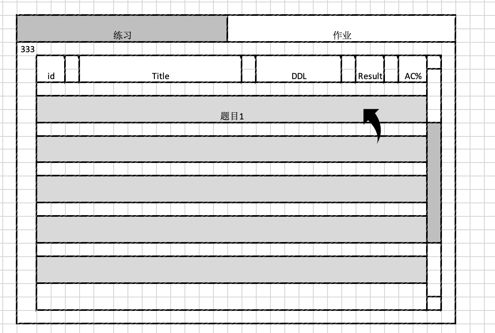
  4. 作业列表 
    点击页眉的练习按钮，切换到练习模式，如上图3 
    显示作业列表，点击某个作业，进入作业详情，如下图5所示 
      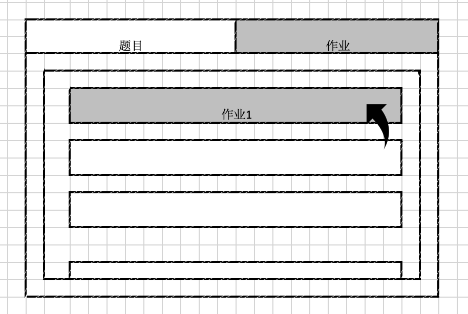
  5. 作业详情 点击题目进入题目界面，题目完成后在题目右方打勾标注。 在附件区可上传附件或输入备注，点击提交按钮提交附件和备注信息。 
    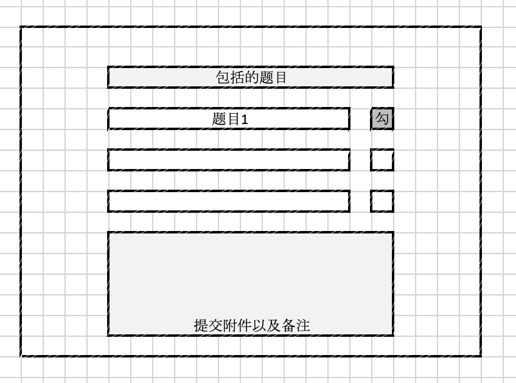
  6. 题目详情（练习、作业、考试相同） 进入题目详情界面先显示题目的描述，包括题目标题、要求、输入输出样例 下方代码区输入代码，选择代码编译的语言，点击提交按钮提交解决方案 点击提交情况可以查看到本题的历史提交情况 
    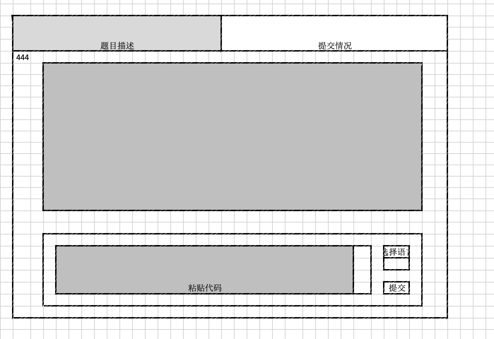
  7. 进行考试 考试界面显示出考试的多道题目和题目信息，包括题目id、标题、截止时间、提交结果提示和ac率 点击题目进入题目详情界面 作业和练习按钮为黑不可点击 
    

**二、教师端**

1. 注册登录

教师点击账号文本框，输入账号

教师点击密码文本框，输入密码

点击登录按钮，进入oj系统教师端

点击注册按钮，进行注册

点击忘记密码按钮，找回密码

2. 教授课程列表

教师点击查看详情，查看课程详情

教师点击添加课程，添加具体课程

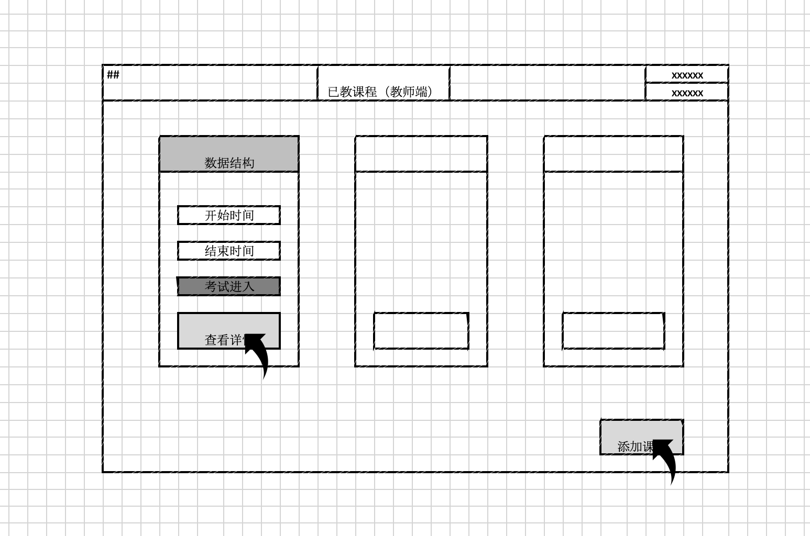

3. 添加课程

点击学生，将学生添加进某课程

点击助教，将助教添加进某课程

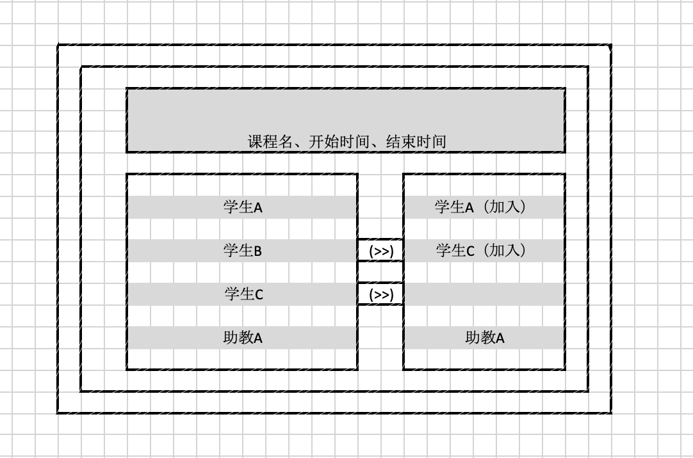

4. 管理作业题目

点击文本框，添加题目详细信息

点击添加题目，将题目添加进系统

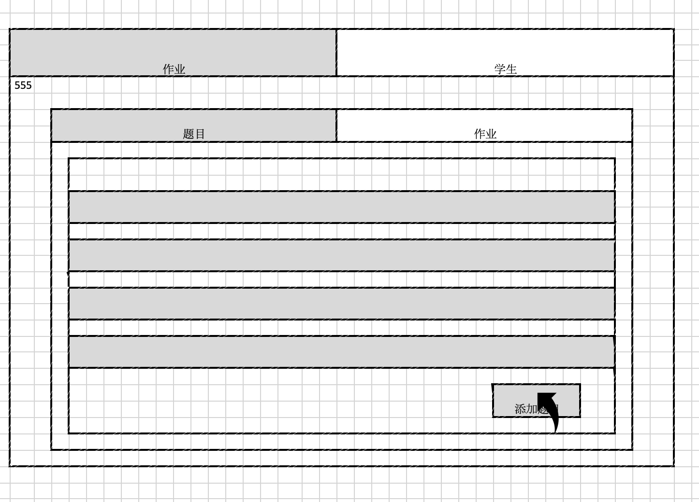

5. 添加题目

点击题目描述，添加题目相关信息

点击测试样例，添加测试数据与输出数据

点击参考答案，添加正确参考答案

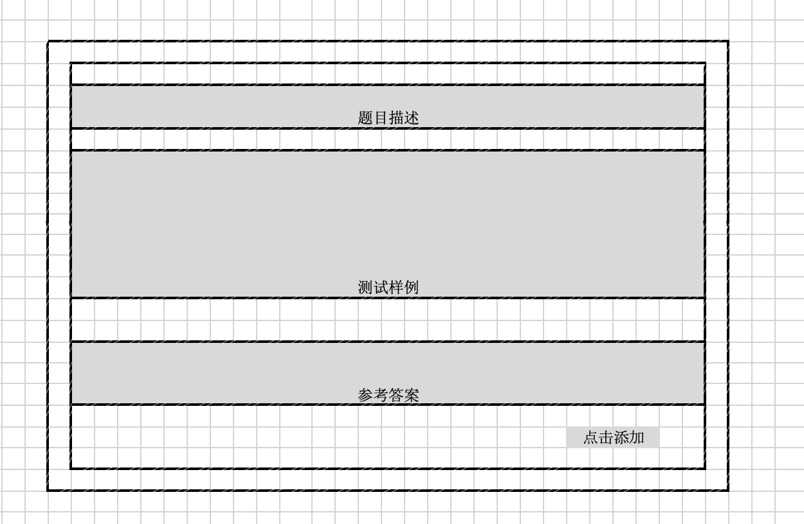

6. 学生作业情况页面

点击学生列表，进入作业详情界面7

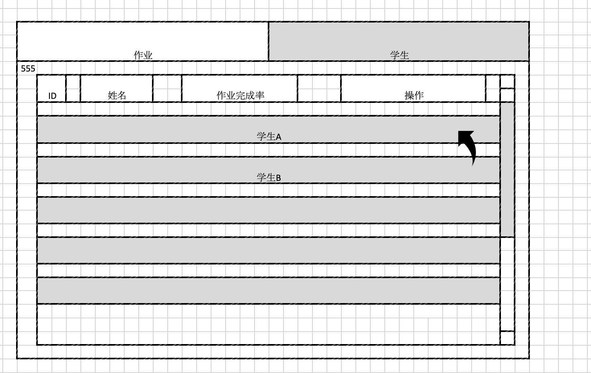

7. 学生作业详情

点击各个题目，可以查看学生单个题目完成情况

点击查看附件备注，可以下载学生附件以及学生备注信息

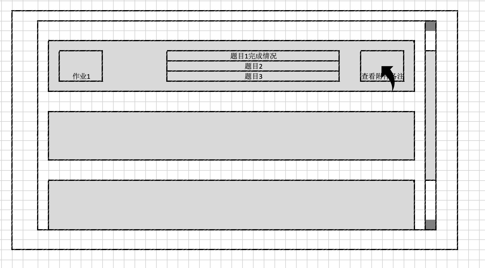
