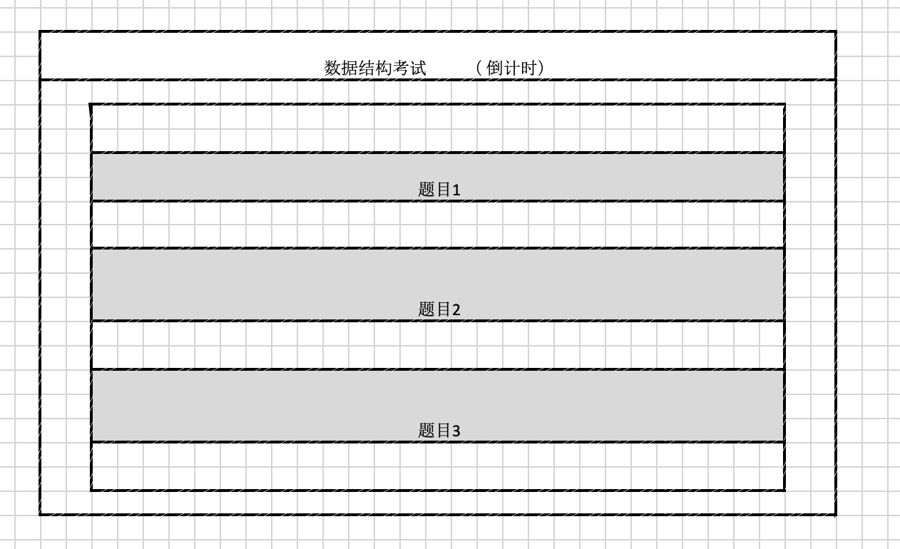

# 16级南开大学企业级应用开发课程作业

作业内容：oj系统

需求设计阶段：

入组后依次打卡： 

- 1611736 钟腾
- 1612911 于浩
- 1511459 魏鹏
- 1612904 薛旭

##### 目录 
[在线oj平台开发要求](#在线oj平台开发要求)  

[数据库设计](#数据库设计)    

[需求思维导图](#需求思维导图)

[操作流程](#操作流程)

## 在线oj平台开发要求

1. 支持长期使用（一学期15次左右，每周至少运行6天没问题）

2. 支持作业查重（初期可全文字符串比对）

3. 支持多语言（中英文）

4. 支持出错判断和整体统计，具体错误提供学生自身改进，全局错误统计供教师了解学生掌握情况。

5. 题目和测试用例的文档导出（可打印出格式良好的题目）

6. 明确学生、任课教师（出题、题目发布、成绩统计）、助教、系统管理员的权限

## 数据库设计

学生表：学号（pk）、密码、学生名、所选课程id（fk）

教师表：教师id（pk）、密码、教师名、所教课程id（fk）

课程表：课程id（pk ai）、课程名、开课时间、结束时间

题目表：题目id（pk ai）、题目名、题目描述、开始日期、截止日期、所属课程id（fk）、样例输入、样例输出、题目类别（1为练习、2为作业、3为考试）

提交方案表：提交结果id（pk ai）、题目id（fk）、学生id（fk）、提交方案、答案结果、提交时间

## 需求思维导图

## 操作流程
**一、学生端**

 1. 注册登录

 2. 进入课程

 3. 练习题目列表
 
 4. 作业列表
 
 5. 作业详情
 
 6. 题目详情（练习、作业、考试相同）
 
 7. 进行考试
 

**二、教师端**

 1. 注册登录

 2. 教授课程列表
 
 3. 添加课程
 
 4. 管理作业题目
 
 5. 添加题目
  
 6. 学生作业情况页面
  
 7. 学生作业详情
  